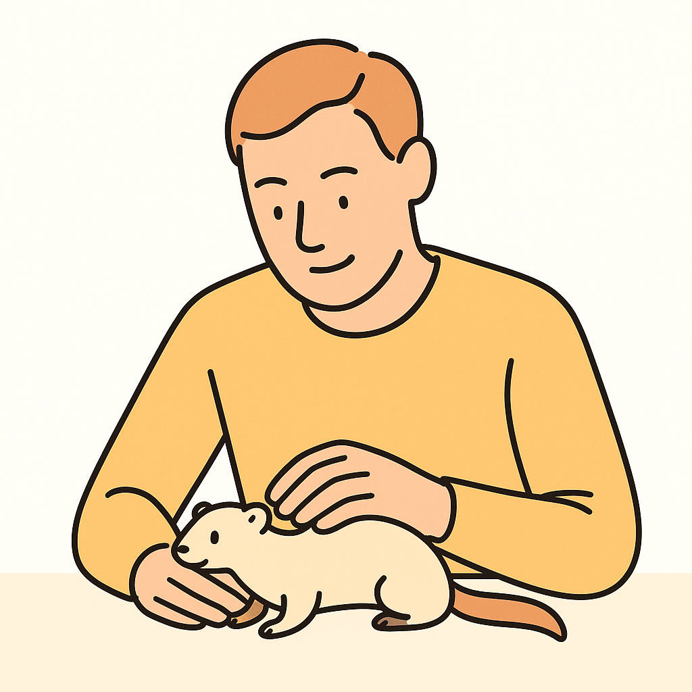
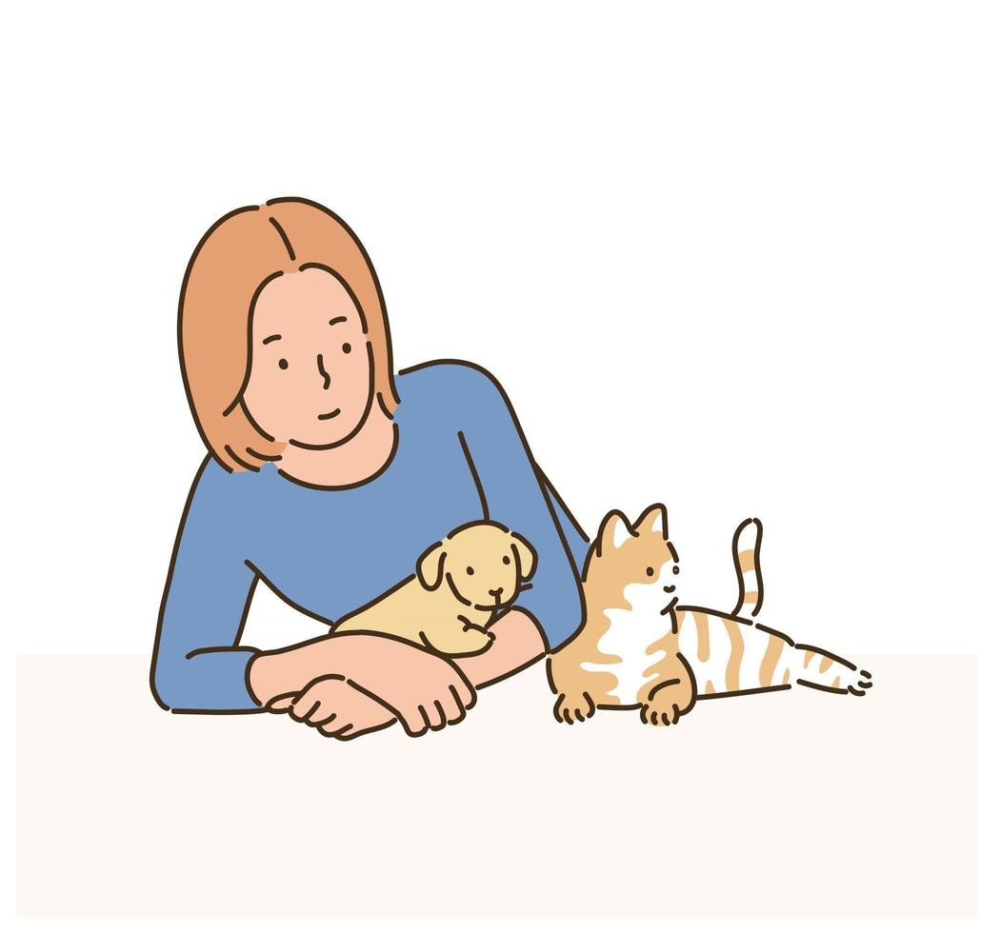

# `ddd`: Dalle-Design-Declarer

> CLI tool to generate JSON art style profiles from images using OpenAI’s Vision + Chat API

## 🎯 Overview

style-cli is a lightweight CLI application that analyzes a given image and outputs an art style profile in JSON format. It leverages OpenAI’s GPT-4 vision capabilities and returns structured style information:

```json
{
  "art_style_profile": {
    "style_name": "...",
    "visual_elements": { … },
    "purpose": "..."
  }
}
```


**🚀 Features**

- Encodes images as Base64 and sends them as input to GPT-4 Vision (gpt-4o-mini).
- Parses the model’s response and prints formatted JSON to stdout.
- Built with Node.js and Vite in CommonJS format for fast startup.
- Comprehensive test coverage with Vitest.


## 📖 Usage

```bash
$ ddd
---
Usage: ddd [options]

Generate JSON art style profile from an image

Options:
  -i, --image <path>  path to input image
  -k, --key <apiKey>  OpenAI API key; or use OPENAI_API_KEY env
  -h, --help          display help for command
```

## ⚙️ Getting started

**📦 Requirements**

- Node.js ≥ 16
- pnpm or npm
- OpenAI API Key


```bash
$ pnpm install # or npm install
$ pnpm build # or npm run build
$ npm link

$ export OPENAI_API_KEY="sk-XXXXXXXXXXXXXXXXXXXXXXXXXXXXX"
# or touch .env and add OPENAI_API_KEY="sk-XXXXXXXXXXXXXXXXXXXXXXXXXXXXX"
```


**📖 Example**

Run the command:

```bash
$ ddd -i ./assets/sample.jpg
```

On success, the JSON art style profile will be printed:

```json
{
  "art_style_profile": {
    "style_name": "Flat Minimalist Line Illustration with Pastel Accents",
    "visual_elements": {
      "shape_language": "Clean, smooth outlines with simplified forms and minimal details",
      "colors": {
        "primary_palette": [
          "Black",
          "White"
        ],
        "accent_colors": [
          "Pastel Yellow",
          "Pastel Orange",
          "Pastel Brown"
        ],
        "shading": "None; flat fills only"
      },
      "lighting": {
        "type": "Flat, no realistic lighting",
        "source_direction": "N/A",
        "shadow_style": "None"
      },
      "materials": {
        "surface_texture": "Flat, uniform color fields",
        "reflectivity": "None"
      },
      "composition": {
        "object_presentation": "Foreground figure with pets, centered with clear negative space",
        "perspective": "Simple side view with slight foreshortening",
        "background": "Solid white"
      },
      "typography": {
        "font_style": "None; no text present",
        "text_placement": "None",
        "color": "N/A"
      },
      "rendering_style": {
        "technique": "2D vector with consistent line weight",
        "detail_level": "Low; focus on silhouette and key accents"
      }
    },
    "purpose": "To convey a warm, friendly atmosphere featuring companionship through minimalistic design."
  }
}
```

Generated result(by ChatGPT): 
|Result(`./assets/result.png`)|Original(`./assets/sample.jpg`)|
|---|---|
|||

## ✅ Testing

Vitest is configured to mock the OpenAI API and validate CLI behavior:

```
$ pnpm test
# or
$ npm run test
```

## 📄 License

MIT License © 2025 ackkerman
